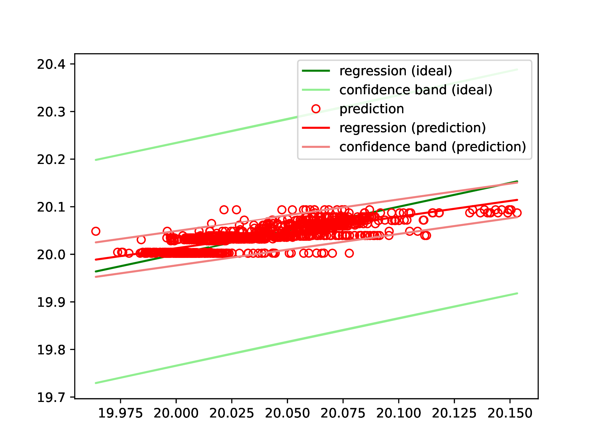
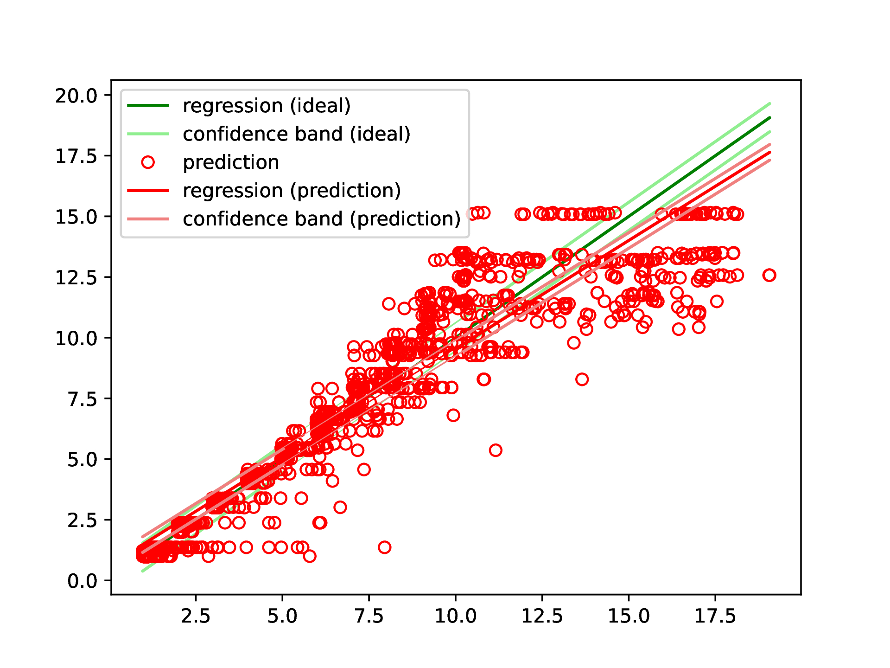

# Validation of Regression Models <!-- omit in toc -->

This is the code and the data set necessary to reproduce the results from the the dissertation "Modellbildung mittels Symbolischer Regression zur Messunsicherheitsbestimmung komplexer Messprozesse". 

Author: Mueller, Tobias 

Chair of Production Metrology and Quality Management at the Laboratory for Machine Tools and Production Engineering (WZL) of RWTH Aachen University - Campus Boulevard 30, 52074 Aachen, Germany

Please cite this code or the data set as: BibTex will be added after publication 

This repository contains an implementation of the validation procedure for regression models as described in [[1]](#1). The implementation also allows the computation of the relevant metrics RMSE on the valid and non-valid part of the regression model.

# Table of Contents <!-- omit in toc -->
- [Validation Procedure as in [1]](#validation-procedure-as-in-1)
- [Installation](#installation)
- [Supported Data Format](#supported-data-format)
- [Usage](#usage)
  - [Application of Validation Procedure](#application-of-validation-procedure)
  - [Compute Metrics](#compute-metrics)
- [Example: CT Scan](#example-ct-scan)
- [Example: Ultrasound](#example-ultrasound)
- [References](#references)
- [License](#license)

# Validation Procedure as in [1]

The idea of the validation procedure as described in [[1]](#1) is to perform a linear regression on the model's predictions $`y_{Model}`$ as a function of the corresponding measurement values $`y_{Real}`$. An ideal  model would always predict the real values. In practice, this is not possible, e.g. due to noise in the measurements. The following image exemplarily illustrates a model's predictions and regression (red) as well as an ideal model (green):


[[1]](#1) also describes the determination of the statistical uncertainties given a significance parameter $`\alpha`$. The were used to visualize the uncertainty bands in the images.

The range in terms of real values of the regression model is now given by the section for which the red uncertainty band lies within the green uncertainty band:


# Installation

For the installation, proceed as described here: https://github.com/tmueller1/symbolic-regression#installation.

# Supported Data Format

The data for this implementation has to be an .xls file with exactly one spreadsheet of the following format


The first row is a header that describes the content of the columns. There has to be a column "y_Real" that contains the targets of the measurements, and a column "y_Model" that contains the corresponding predictions of the model.

As comma separator, a "." ("dot", e.g. 12.3) has to be used.

# Usage

The implementation consists of the two Python scripts "apply_validation_procedure.py" and "compute_metrics.py". The script "apply_validation_procedure.py" applies the validation procedure, while "compute_metrics.py" can be used to compute RMSE on the valid and non-valid part of the regression model.

## Application of Validation Procedure

1. Specify the path of the dataset ("file_path"), the data fraction to use ("fraction_of_data"), and the desired significance level ("alpha") in the section "User Input" in the "apply_validation_procedure.py" source code: 
    ```
    ##### User Input #####
    file_path = "/path/to/data/dataset.xls"
    fraction_of_data = 1
    alpha = 0.01
    ##### User Input #####
    ```
2. Run "apply_validation_procedure.py", e.g. via the command `python apply_validation_procedure.py`.
3. A plot window pops up that shows the results of the validation procedure. In the terminal, the valid range of the regression model is displayed.

## Compute Metrics

1. Specify the path of the dataset ("file_path"), and the number of features in the section "User Input" in the "compute_metrics.py" source code: 
    ```
    ##### User Input #####
    file_path = "/path/to/data/dataset.xls"
    n_features = 4
    ##### User Input #####
    ```
2. Run "compute_metrics.py", e.g. via the command `python compute_metrics.py`.
3. In the terminal, the RMSE on the given part of the regression model is displayed.

# Example: CT Scan

The application of the validation procedure with $`\alpha = 0.01`$ for the symbolic regression on the CT scan dataset after the feature selection (see https://github.com/tmueller1/symbolic-regression#example-ct-scan) leads to the following plot:



Thus, the regression model is valid on the whole range.

The other metrics are computed to be:
- $\mathrm{RMSE} = 0.018993188330092434$


# Example: Ultrasound

For the symbolic regression on the ultrasound dataset after the feature selection (see https://github.com/tmueller1/symbolic-regression#example-ultrasound), the validation procedure with $`\alpha = 0.60`$ leads to the following plot:



The regression model is valid for $`3.37 \leq y_{Real}\leq8.16`$. 

On the valid part of the regression, the following metrics are obatined:
- $\mathrm{RMSE} = 0.7062954864798153$

For the non-valid part, the metrics are given by:
- $\mathrm{RMSE} = 1.6572754109094656$

The RMSE on the valid part of the regression model is significantly lower than the RMSE on the non-valid part. This observation is in agreement with the results of the validation procedure as a high RMSE (especially if there is a known range with a significantly lower RMSE) is a characteristic of a non-valid regression.

# References
<a id="1">[1]</a> 
T. Mueller, M. Huber and R. Schmitt, "Modelling Complex Measurement Processes for Measurement Uncertainty Determination," International Journal of Quality & Reliability Management 37, 494-516 (2020)

# License

Copyright 2022 Tobias Mueller - RWTH Aachen Univerity - Laboratory for Machine Tools and Production Engineering WZL of RWTH Aachen

Redistribution and use in source and binary forms, with or without modification, are permitted provided that the following conditions are met:

1. Redistributions of source code must retain the above copyright notice, this list of conditions and the following disclaimer.
2. Redistributions in binary form must reproduce the above copyright notice, this list of conditions and the following disclaimer in the documentation and/or other materials provided with the distribution.
3. Neither the name of the copyright holder nor the names of its contributors may be used to endorse or promote products derived from this software without specific prior written permission.

THIS SOFTWARE IS PROVIDED BY THE COPYRIGHT HOLDERS AND CONTRIBUTORS "AS IS" AND ANY EXPRESS OR IMPLIED WARRANTIES, INCLUDING, BUT NOT LIMITED TO, THE IMPLIED WARRANTIES OF MERCHANTABILITY AND FITNESS FOR A PARTICULAR PURPOSE ARE DISCLAIMED. IN NO EVENT SHALL THE COPYRIGHT HOLDER OR CONTRIBUTORS BE LIABLE FOR ANY DIRECT, INDIRECT, INCIDENTAL, SPECIAL, EXEMPLARY, OR CONSEQUENTIAL DAMAGES (INCLUDING, BUT NOT LIMITED TO, PROCUREMENT OF SUBSTITUTE GOODS OR SERVICES; LOSS OF USE, DATA, OR PROFITS; OR BUSINESS INTERRUPTION) HOWEVER CAUSED AND ON ANY THEORY OF LIABILITY, WHETHER IN CONTRACT, STRICT LIABILITY, OR TORT (INCLUDING NEGLIGENCE OR OTHERWISE) ARISING IN ANY WAY OUT OF THE USE OF THIS SOFTWARE, EVEN IF ADVISED OF THE POSSIBILITY OF SUCH DAMAGE.
